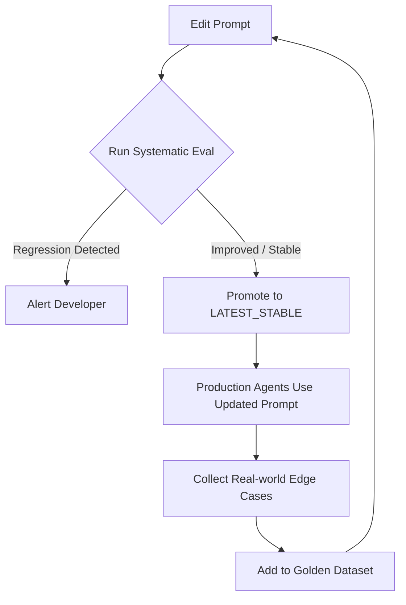

# Eligenic: Systematic Evals & Prompt Management

To move beyond trial-and-error, Eligenic provides the infrastructure for treating prompts as managed assets and evaluations as continuous pipelines.

## 1. Built-in Prompt Management & Versioning

Instead of hardcoding prompts in Elixir modules, Eligenic manages them through a versioned system, potentially backed by a database or version-controlled files.

### The `Eligenic.Prompt` Registry
- **Database-Backed Prompts:** Prompts can be stored in the primary Postgres DB, allowing for updates without redeploying the app.
- **Automatic Versioning:** Every change to a prompt creates a new version (e.g., `v1.0.1`). Versions are immutable.
- **Environment Routing:** Assign "tags" to versions (e.g., `LATEST_STABLE`, `EXPERIMENTAL`). Your agents can be configured to use specific tags.
- **A/B Testing:** Easily route a percentage of traffic to different prompt versions to compare real-world performance.

### LiveView Prompt Editor
Eligenic can provide a "Developer Dashboard" where:
- Prompts can be edited and tested in real-time.
- Changes are automatically hashed and versioned.
- Previous versions can be restored with a single click.

---

## 2. Systematic Evaluation Pipeline

Evaluation is not a one-time event; it is a continuous pipeline that runs whenever a system component (prompt, skill, or model) changes.

### The Eval Workflow
1. **Trigger:** A developer updates a prompt in the Dashboard.
2. **Drafting:** The system creates a draft version.
3. **Execution:** The "Systematic Eval" runner executes the new prompt against a **Golden Dataset** (curated inputs and expected outputs).
4. **Judging:** An automated "Judge" (LLM-as-a-judge) scores the outputs based on predefined metrics (accuracy, tone, structure).
5. **Comparison:** The system compares the new scores against the `LATEST_STABLE` version.
6. **Reporting:** A detailed report is generated, highlighting improvements or regressions.

### CI/CD Integration
Eligenic provides Mix tasks to integrate evals into your CI/CD pipeline.
- **Gatekeeping:** Fail a CI build if a prompt update causes a significant drop in evaluation scores.
- **Observability:** Export eval results to Prometheus/Grafana to track model performance over time.

---

## 3. The "Golden Dataset" Management

A robust eval system relies on high-quality data. Eligenic helps manage this:
- **Case Collection:** Easily "promote" real-world edge cases from your logs to the Golden Dataset.
- **Synthetic Data Generation:** Tools to use an LLM to generate diverse test cases for a specific skill.
- **Verification:** Tools for humans to manually verify and label evaluation results to improve the "Judge's" accuracy.

---

## 4. Systematic Loop

